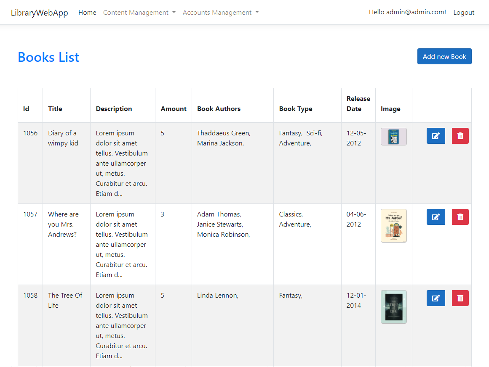

# LibraryWebApp
## Table of contents
* [Introduction](#Introduction)
* [Users Features](#Users-Features)
  * [Guest account features](#Guest)
  * [Client account features](#Customer)
  * [Employee account features](#Employee)
  * [Admin account features](#Admin-user)
* [Technologies](#Technologies)
* [Application exemplary usage](#Application-exemplary-usage)

## Introduction
This is a Library Web Application. As a guest you can browse the books and read comments. Other users such as client can reserve books, comment or rate them, employees
can manage existing books in library or create new ones and manage reservations. Admins can manage accounts.
## Users Features
### Guest
#### First account created is admin account
* Register, login
* Browse books
* Add book to reservation cart
* Display book details
* Check comments
### Customer
* Logout
* Comment or rate book
* Add book to reservation cart 
* Make a reservation
* Check status of reservations and fees
* Check history of reservations and fees
* Cancel reservation
* Delete own comments or rates
### Employee
* Delete comments
* Perform CRUD operations on books, book types, authors, fees
* Delete reservations or fee
* Change status of reservation or fee
### Admin user
* Perform CRUD operations on any entity
* Create, modify, delete client accounts,employee accounts and admin accounts
* Change employee earnings
## Technologies
* ASP .NET Core 3.1
* Entity Framework 3.1.21
* Bootstrap
* JavaScript
### Additional Libraries
* Serilog
* SweetAlert2
* Fontawesome
### Database
* MS SQL Server 2019
## Application exemplary usage
### Main page

### Book details

### Comment section

### Reservation cart

### Reservation history

### Fees

### Reservation management

### Worker profile

### Account creation

### Adding new book

### List of books

